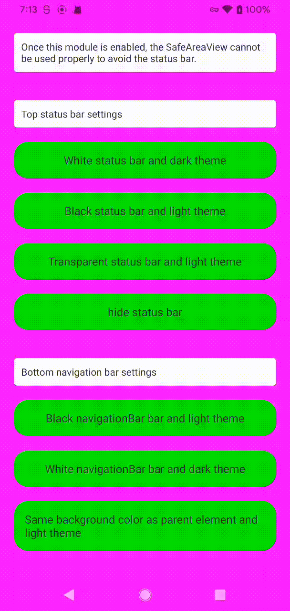
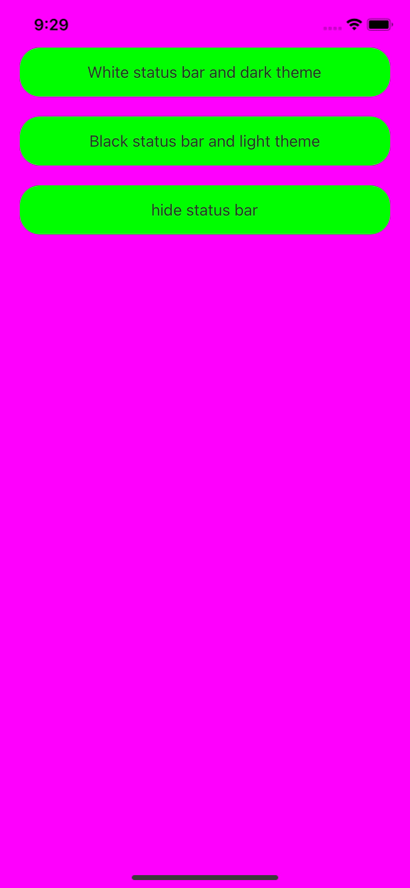

# slide-areas-module

Modify the theme and color of the top status bar and bottom navigation bar of Android.
Note that SafeAreaView will not work once the module is called.
* change StatusBar need Androi 6.0
* change NavigationBar need Androi 8.0   
Compatible with ios

| Attribute Name  | Explain  |   
|  ----  | ----  |
| statusBarTheme  | Status bar style: dark / light, The dark attribute is black color font and the light attribute is white color font |
| statusBarColor  | Status bar background color （Android Only, Transparent if not set） |
| hideStatus  | Hide status bar |
| navigationBarTheme  | navigation bar style: dark / light, The dark attribute is a black Icon and the light attribute is a white Icon （Android Only） |
| navigationBarColor  | navigation bar background color, Set transparency to show only gray（Android Only） |

用于修改安卓 APP 顶部状态栏和底部导航栏的主题和背景色，  
需要注意的是，一旦启用该模块，SafeAreaView 将不再起作用。  
兼容 ios

| 属性名字  | 作用  |   
|  ----  | ----  |
| statusBarTheme  | 状态栏风格: dark / light，dark 展示黑色字体，light 展示白色字体 |
| statusBarColor  | 状态栏背景色 （只能安卓使用，不设置就为透明） |
| hideStatus  | 隐藏状态栏 |
| navigationBarTheme  | 导航栏风格: dark / light （只能安卓使用，dark 展示黑色 icon，light 展示白色 icon） |
| navigationBarColor  | 导航栏风格背景色，设置透明只能展示灰色（只能安卓使用） |

## Installation
add this to your package.json and run `npm i`
```json
{
  "slide-areas-module": "github:amazingCoding/react-native-slide-areas-module"
}
```

## Usage

```js
interface BarProps {
  statusBarTheme?: Theme,
  statusBarColor?: string | null,
  navigationBarTheme?: Theme,
  navigationBarColor?: string | null,
  hideStatus?: boolean
}
import SlideBar from 'slide-areas-module';
const slideBar = SlideBar.getInstance()
slideBar.setBar({})
```

## demo
Android   


Ios


## Contributing

See the [contributing guide](CONTRIBUTING.md) to learn how to contribute to the repository and the development workflow.

## License

MIT
